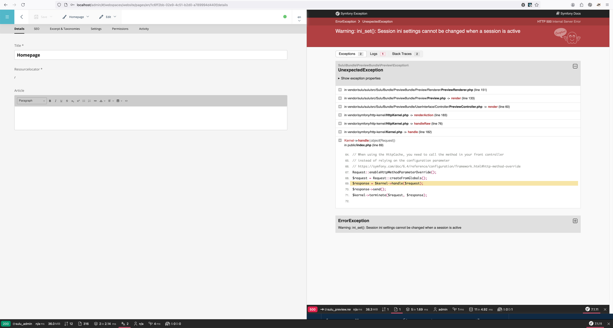

This is a reproducer for https://github.com/sulu/sulu/issues/7713

What did I change:
* Basically, I changed the docker compose config a bit to run it without a local PHP installation.
* I added the line containing "save_path" (line number 11) at config/packages/framework.yaml

Steps to run:
* Run `docker compose up -d`
* Run `docker-compose exec php bash`
* Run `php -dmemory_limit=4G /usr/local/bin/composer install`
* Run `bin/console sulu:build dev --no-debug`
  * Confirm with ```Look good? (y)``` with `y`
* Open web browser
* Open URL http://localhost/admin
  * Use credentials admin / admin to Login
* Click on the burger menu on the top left
* Click Webspaces
* Hover Website in the list with the mouse
* Click on the pencil icon
* Look at the preview on the right side
* An error is shown
  * Warning: ini_set(): Session ini settings cannot be changed when a session is active
  * )
